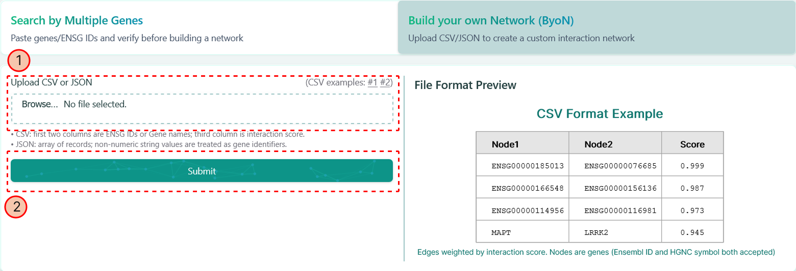

import { Steps } from 'nextra/components';

# Build your own Network (ByoN)

**This approach allows you to upload your own gene-gene interactions**

At the main page of our website, you can also click the tab "Build your own Network (ByoN)" on the top panel, you will see the corresponding dashboard on the right as below:

<Steps>
### Uploading the network file

You can upload your own network file, which contains the gene-gene interaction information, either in CSV format or in JSON format. An example is showing on the right of the above picture.

### Clicking "Submit" Button

After click "Submit", our tool will lead you to the [network visualization page](../network-visualization.mdx).
</Steps>