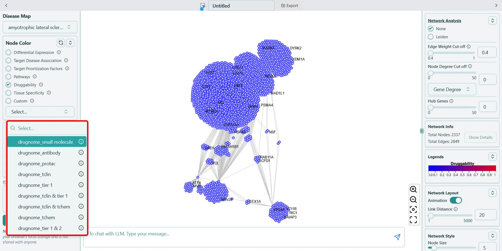

# Druggability

**Druggability scores from DrugnomeAI ranging from `0` to `1`**

Druggability scores is represented in both color and size. The color range start from “blue” to “red” where more “red” means it is more druggable whereas blue means less druggable. We use **\{"drugnome"}\_\{disease-agnostic/domain specific model}** as the format, for example, “drugnome\_small molecule”, shown as below:

For more information, please refer to their [website](https://astrazeneca-cgr-publications.github.io/DrugnomeAI/features.html).