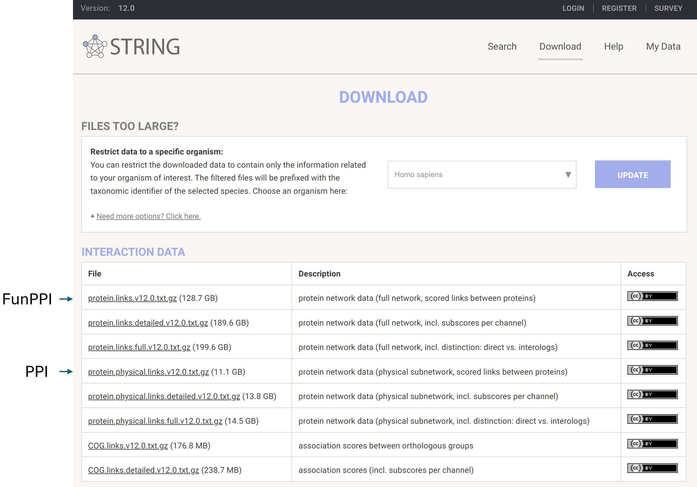

# Knowledge Base

**Various data available in your network visualization**

The knowledge base provides the node and edge properties of network visualization and analysis, based on the **Reference Genome data** and **Protein-Protein Interaction (PPI) network data**.

### Reference Genome data

We used reference genome from HGNC database, with Ensembl ID as the primary key identifier. All data was aligned with the reference genome before ingested into the knowledge base. This alignment ensures consistency and compatibility across datasets, enabling accurate integration and analysis within the system.

### **Protein-Protein Interaction (PPI) network data**

In the current version of the portal, protein interaction network data is curated from STRING database and ConsensPathDB. The network in the network visualization page is constructed based on the PPI data.

We also have different kinds of data available on the left panel of network visualization page, which allows you to change the network property based on personal needs. The data behind each feature is divided into 2 different types -- **disease-dependent** and **disease independent**.

Data types are transformed to defined representations, so that they can be handled consistently and displayed intuitively by the frontend.

### Disease-dependent data

Disease-dependent data varies with different diseases, including Differential Expression (_Differential expression in Log2 fold change_) and Target Disease Association (_Gene Disease Association score_).

* Differential expression results for disease vs control are calculated based on transcriptomic and Proteomic data and is available from knowledge base in the form of log2-fold change.
* Target disease association score is from Open Targets portal. It qualifies the strength of the association between a gene and a disease. This score is derived using a combination of evidence from diverse data sources, e.g. genetic studies, transcriptomics, somatic mutations, drugs and pathways, etc.

### Disease-independent data

Disease-independent data DO NOT vary with different diseases, including Target Prioritization Factors (Target prioritization factors from Open Targets Platform), Pathway (_Pathway membership from KEGG and Reactome_), Druggability (_Druggability score form Open Targets_) and Tissue Specificity (_Tissue-specific expression from GTEX and HPA_).

* Target prioritization factors leverage the comprehensive datasets and tools provided by Open Targets to rank and prioritize biological targets, particularly for drug discovery and disease research.
* [Pathway ](knowledge-base/pathways.mdx)in our tool contains complete pathway data from **KEGG** and **Reactome** database. There are 360 pathways available in KEGG and 2725 pathways available in Reactome. This pathway information can be mapped on the network or executing real-time functional enrichment analysis from the interface.
* [Druggability ](knowledge-base/druggability.mdx)scores are derived directly from DrugnomeAI, it estimates the druggability likelihood for every protein-coding gene in the human exome [\[1\]](knowledge-base.mdx#citation).
* [Tissue Specificity](knowledge-base/tissue-specificity.mdx) includes specific expression calculated from bulk RNA-seq and cell type specific expression data calculated from single nuclei RNA-seq is available in the knowledge base to extract information specific to a given tissue or cell type.

### Knowledge Base Summary

| Data type | Representation | Experiment types | Sources |
| --- | --- | --- | --- |
| [Differential Expression](knowledge-base/differential-expression.mdx) | [-Inf, +Inf] | RNAseq, Proteomics | AD (Mayo, ROSMAP, MSBB) |
| [Target Disease Association](knowledge-base/target-disease-association.mdx) | [0, 1] | AI, Meta-scores | Open Targets version - 24.04 |
| [Target Prioritization Factors](knowledge-base/target-prioritization-factors.mdx) | [-1, 1] | | Open Targets version - 24.04 |
| [Pathway](knowledge-base/pathways.mdx) | Binary | Curation | KEGG (release 112), Reactome (v90) |
| [Druggability](knowledge-base/druggability.mdx) | [0, 1] | AI, Meta-scores | DrugnomeAI |
| [Tissue Specificity](knowledge-base/tissue-specificity.mdx) | [0, +Inf] | single cell RNAseq & single cell databases | GTEx, HPA (v23.0) |

#### Citation

> _\[1] Arwa et al. DrugnomeAI is an ensemble machine-learning framework for predicting druggability of candidate drug targets. Commun Biol 2022 Nov 24;5:1291. doi: [10.1038/s42003-022-04245-4](https://doi.org/10.1038/s42003-022-04245-4)_
