import { Image } from 'nextra/components';

# Right panel

**Modifications of inherent network parameters**

Now we focus on the functions of right panel.

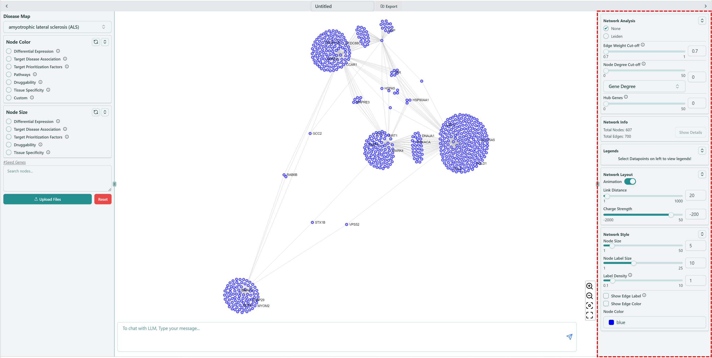

### Network Analysis

You can reduce the network complexity and focus on the key drivers of your network here by selecting different radio buttons.

* **Community detection**

We offer community detection algorithm **Leiden** [\[1\]](right-panel.mdx#citation) in our tool, you can easily use this algorithm to find possible communities in the network, based on your own choice of **Resolution**, **Minimum Community Size** and **Weighted**. Here is a [help video](../use-cases-and-short-help-videos.mdx#community-detection).

1. Click Leiden.
2. Select proper Resolution and Minimum Community Size, check or uncheck Weighted, to involve edge weight or not.
3. Click Apply.
4. Select/Deselect communities to keep/drop the detected communities in the network.

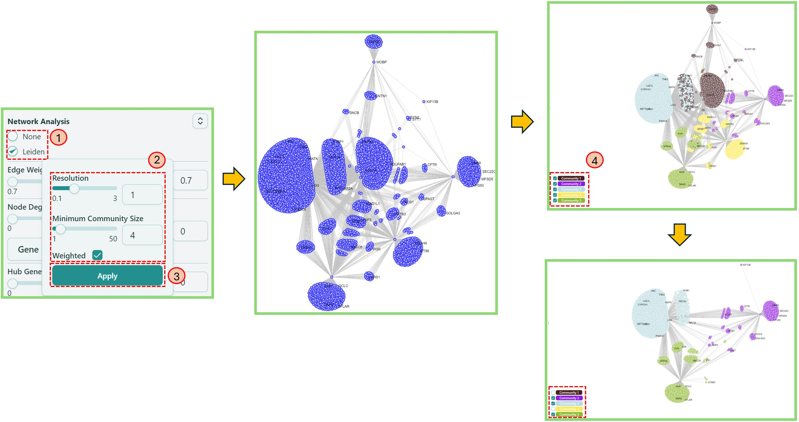

* **Edge Weight Cut-off**

This feature allows you to filter out the nodes with less edge weight, so that you can focus more on the clustered nodes.

1. Use the **range slider** or directly **type in** the number to select an appropriate value and filter out the nodes with edge weight less than the selected value.

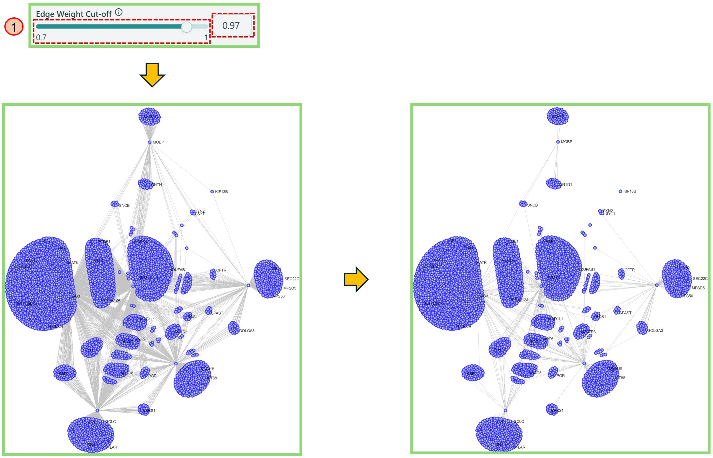

* **Node Degree Cut-off**

This feature allows you to shrink the network based on the node degree of specific features.

1. In the dropdown list, you can select your preferred feature.
2. Use the **range slider** or directly **type in** the proper number to select an appropriate gene degree, making the network reduced as you want. We currently provide 2 types of values to reduce the network — Gene degree and Tissue Specificity values.

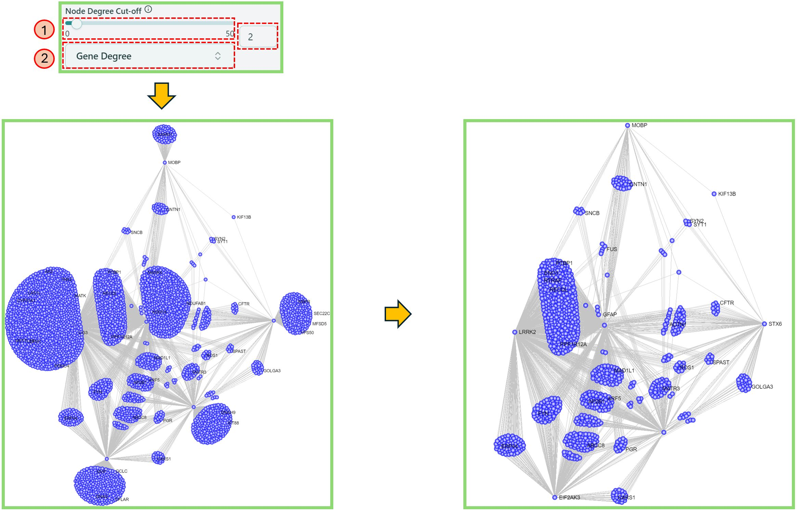

* **Hub Genes**

Hub Genes will highlight the nodes only with larger or equal to the number of edges defined by yourself.&#x20;

1. Use the **range slider** or directly **type in** the proper number to select an appropriate value to highlight the nodes with node degrees more than or equal to the selected value.

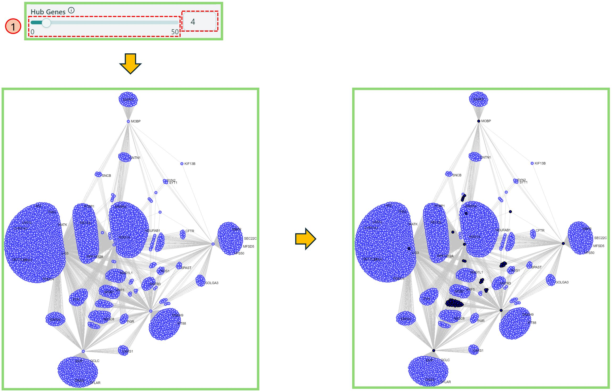

### Network Info

When the network is rendered, the basic information of the network is shown here, i.e. total nodes, total edges.

You can also click `Show Details` button after selecting the nodes in the network. Please refer to [Node Details & GSEA in Network visualization board](network-visualization-board.mdx#node-details--gsea) section for more information.

### Legends

You can see the Legend of each feature in Node Color section.

1. Choose a feature in Node Color section on the [Left panel](left-panel.mdx), then navigate to Legends section on the [Right panel](right-panel.mdx) to get the legend of a specific feature.

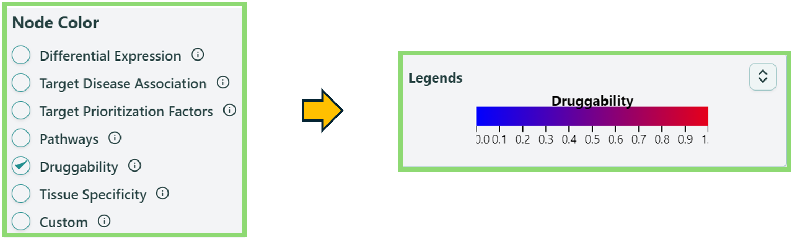

### Network Layout

You can make the node clusters more separated.

1. Use the **range slider** or directly **type in** the proper number in Link Distance, this will make the edge of the network longer, helping the clusters separated from each other.
2. Use the **range slider** or directly **type in** the proper number in Charge Strength, this will separate the nodes from each other.

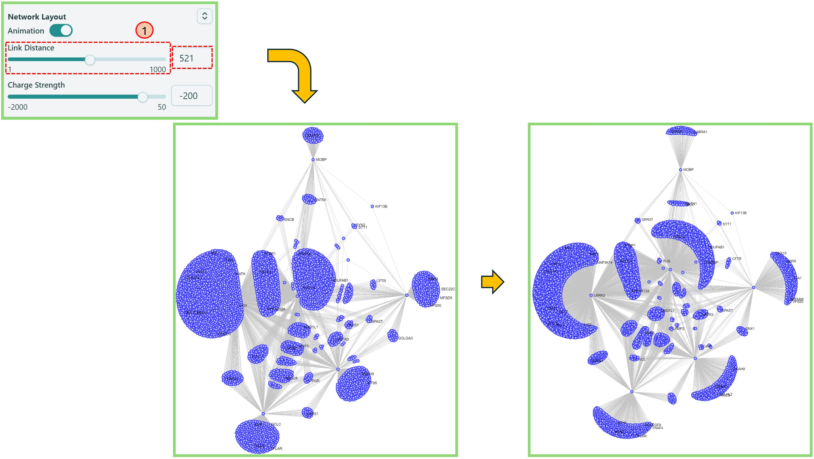

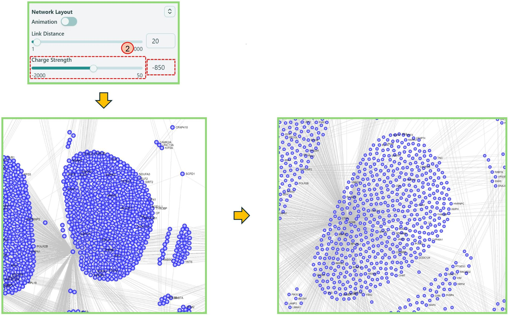

You can also use "Stop Animation" button to stop dancing of the network.

### Network Style

You can change basic parameters of the network.

* **Node Size**

You can make node size larger/smaller.

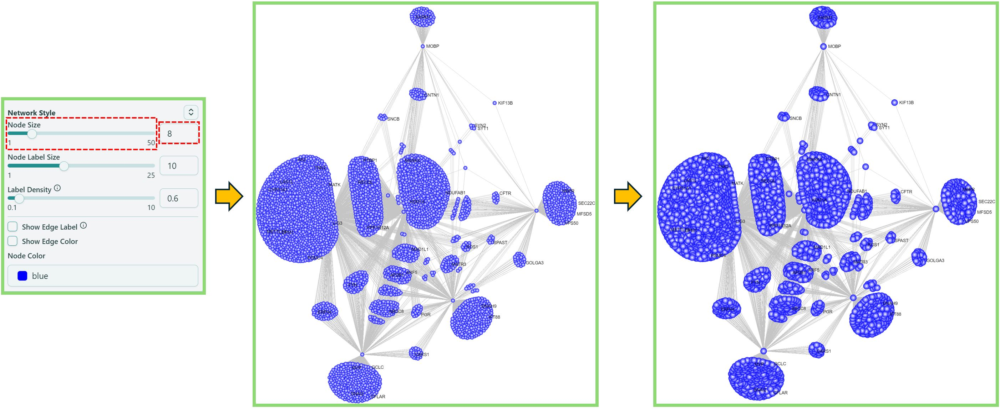

* **Node Label Size**

You can make node label size larger/smaller.

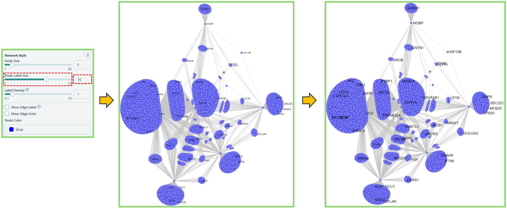

* **Label Density**

You can change the label density here.

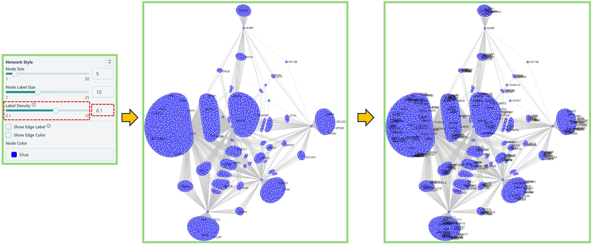

* **Show Edge Label**

You can make edge label (edge weight) appear/disappear. To view more edge labels, simply zoom in the network.

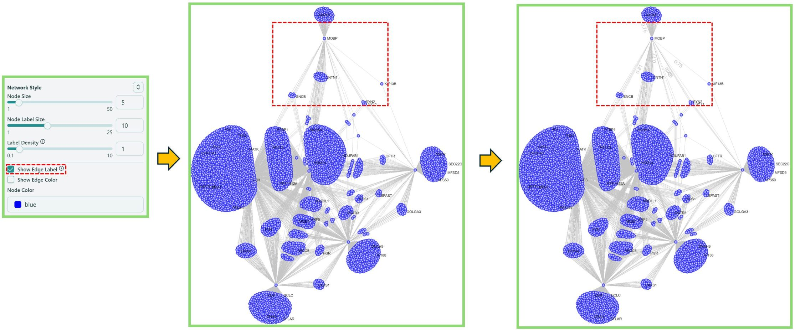

You can also refer to the information icon <Image width={30} height={30} src="/image/docs/info-tooltip.png" alt="Info Button" style={{ display: 'inline', aspectRatio: '1/1' }}/> for the large network tips.

* **Show Edge Color**

You can change the edge color here. Please refer to the Legends section on the [Right Panel](right-panel.md) for the color meaning.

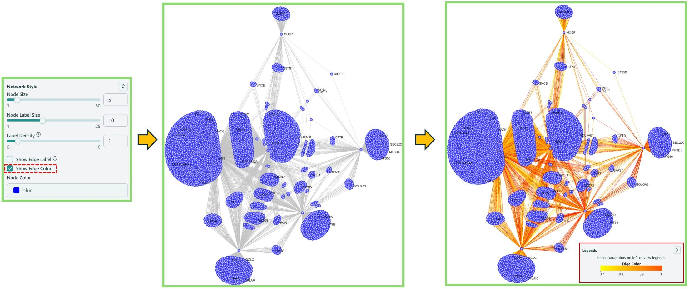

* **Node Color**

You can change the node color here, simply by selecting different color or type different color names.

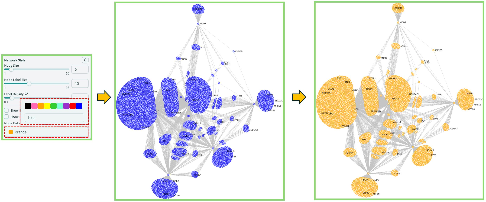

***

#### Citation

> _\[1] Traag, V. A., et al. « From Louvain to Leiden: Guaranteeing Well-Connected Communities ». Scientific Reports, vol. 9, no 1, décembre 2019, p. 5233. DOI.org (Crossref), doi: [10.1038/s41598-019-41695-z](https://arxiv.org/abs/1810.08473)._
